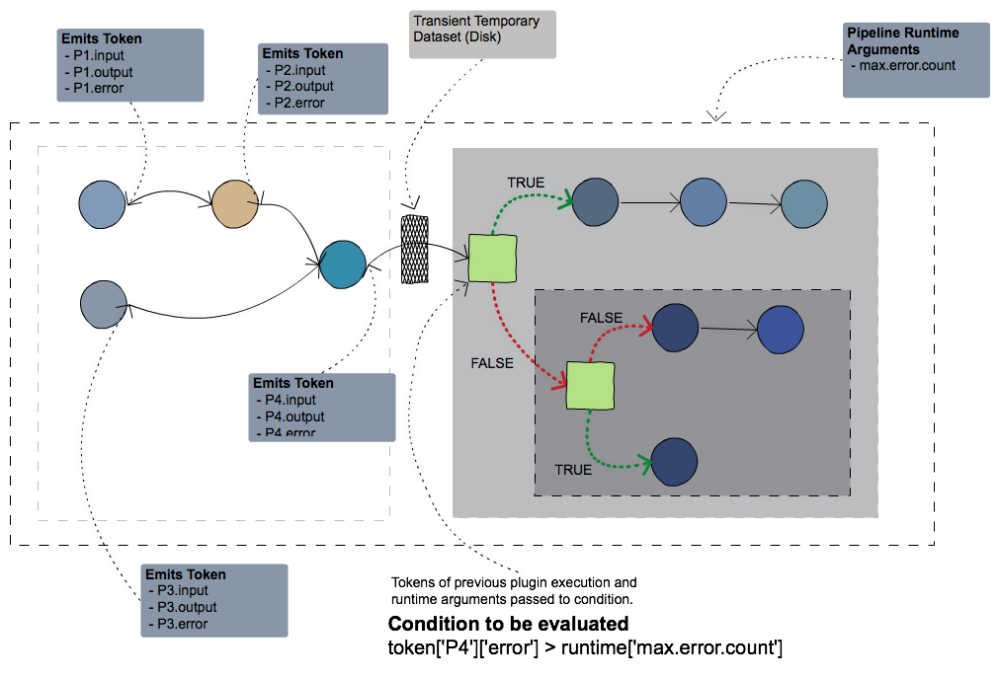

# Condition Plugin

A control flow plugin that allows conditional execution within pipelines. The conditions are specified as expressions and the variables could include values specified as `runtime` arguments of the pipeline, `token` from plugins prior to the condition  and `global` that includes global information about pipeline like stage, pipeline, logical start time and plugin.

Condition plugin specifies a boolean expression to be evaluated. During pipeline execution, the condition expression specified is evaluated resulting in boolean value (either `true` or `false`). Depending on the result of evaluation, either the downstream pipeline connected along `true` path is executed or along the `false` path is executed. At at point in time, only one path is executed. 



## Expression

Conditions are specifed as boolean expression. A Boolean expression is a logical statement that is either TRUE or FALSE . Expressions can compare data of any type as long as both parts of the expression have the same basic data type or compatible data type. You can test data to see if it is equal to, greater than, or less than other data. Following are some of the example of an expression that can be specified. 

* Checks if the `runtime` argument `filepath` contains `input`.
```
 runtime['filepath'] =~ ".*input_.*"
```

* Checks two `runtime` arguments `a` and `b`.
```
 runtime['a'] > runtime['b']
```

* Checks `output` record count of `File` plugin from `token` with `runtime` value `count`.
```
 token['File']['output'] > runtime['count']
```

* Checks `error` record count of `Data Quality plugin` from `token` with `runtime` value `max_error`
```
token['Data Quality']['error'] <= runtime['max_error']
(token['File']['output'] > runtime['count']) and (runtime['a'] > runtime['b'])
(token['File']['output'] > runtime['count']) || (runtime['a'] > runtime['b'])
token['File']['output'] < runtime['count'] && token['File']['error'] < 1
```

* Checks if a `runtime` argument `value` is provided and it's not `null` and plugin `File` `error` count is less than 1. 
```
 !isnull(runtime['value']) && token['File']['error'] < 1
```

* Takes the `max` of plugin `File1` `output` count and `File` `output` count and checks if it's greater than `runtime` argument that is specified as a macro. 
```
 math:max(toDouble(token['File1']['output']), toDouble(token['File2']['output'])) > runtime[$variable]
```

### Variables

In the conditional expression, there are three types of `map` variables available to be used within an expression :

* **Runtime Variables** (E.g. `runtime['<variable-name>']`) -- Is a map variable that contain values  ,
* **Token Variables** (E.g. `token['<plugin-name>']['input'|'output'|'error']`) & 
* **Global Variables** (E.g. `global['pipeline'|'namespace'|'logical_start_time'|'plugin']`)

### Operators

Following are the boolean operators that can be used within the boolean expression specifying the condition

#### Boolean `and` or `&`
The operator `&&` can be used as well as the word `and` to specify composing conditions, e.g.
```
cond1 and cond2
```
and
```
cond1 && cond2
```

#### Boolean `or` or `||`

The operator `||` can be used as well as the word `or` to specify composing conditions, e.g.
```
cond1 or cond2
```
and
```
cond1 || cond2
```

#### Boolean `not` or `!`

The operator `!` can be used as well as the word `not` to specify composing conditions, e.g.
```
!cond
```
and
```
not cond
```

#### Boolean `&`

The bitwise operator `&` is used as follows
```
!cond
```
and
```
not cond
```

#### Ternary conditional `?:`	

The ternary conditional operator `condition ? if_true : if_false` operator can be used as well as the abbreviation value `?:` `if_false` which returns the value if its evaluation is defined, non-null and non-false.The condition will evaluate to false when it refers to an undefined variable or null. e.g.

```
val1 ? val1 : val2
```
and

```
val1 ?: val2 
```

Where `val1` and `val2` could be `true` or `false`.


### Macros

## Transient Dataset

